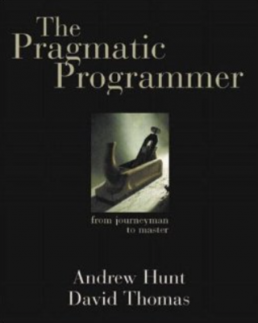

This is the book that most influenced the first steps of my career.
He put order in the head of a passionate but messy young programmer.

"While many software books focus on the intricacies of specific languages or idiosyncrasies of specific problems, The Pragmatic Programmer centers on how to effectively use software to solve problems. As the subtitle — From journeyman to master — implies, the book contains information to pragmatically grow as the developer; not just how to be a good programmer, but also how to solve the difficult problems that surround coding."

Many books claim to be a must-read for software development woes, but The Pragmatic Programmer is truly a must read.

Later I found that Andrew Hunt and Dave Thomas are among th authors of the ["Manifesto for Agile Software Development"](/agile-manifesto/).
They have revised the original edition and created another masterpiece — [The 20th Anniversary Edition](https://pragprog.com/book/tpp20/the-pragmatic-programmer-20th-anniversary-edition).

---
