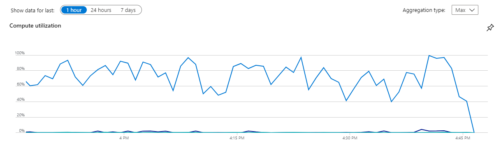
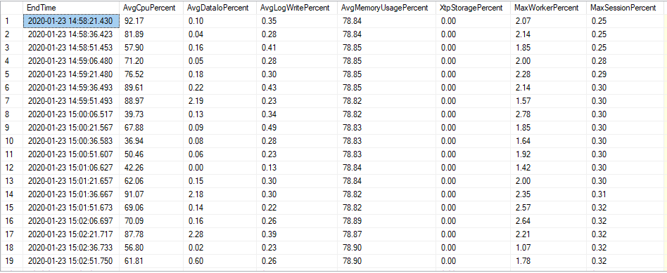
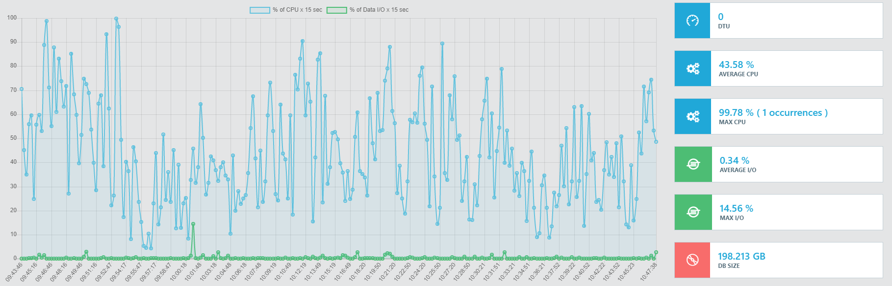

Every project that uses Azure Sql Server needs a way of monitoring tha database load.
The portal of Azure gives a beautiful graph on the utilization of the load of the server.



I wanted to understand where this data came from and I ended up using sys.dm_db_resource_stats.


```jsx
  SELECT end_time as EndTime,
    avg_cpu_percent as AvgCpuPercent,
    avg_data_io_percent as AvgDataIoPercent,
    avg_log_write_percent as AvgLogWritePercent,
    avg_memory_usage_percent as AvgMemoryUsagePercent,
    xtp_storage_percent as XtpStoragePercent,
    max_worker_percent as MaxWorkerPercent,
    max_session_percent as MaxSessionPercent
  FROM sys.dm_db_resource_stats
  ORDER BY end_time
```



The query returns 256 rows of the last hour of database utilization.
Now you can create a real-time graph using the technology you like most.



---
